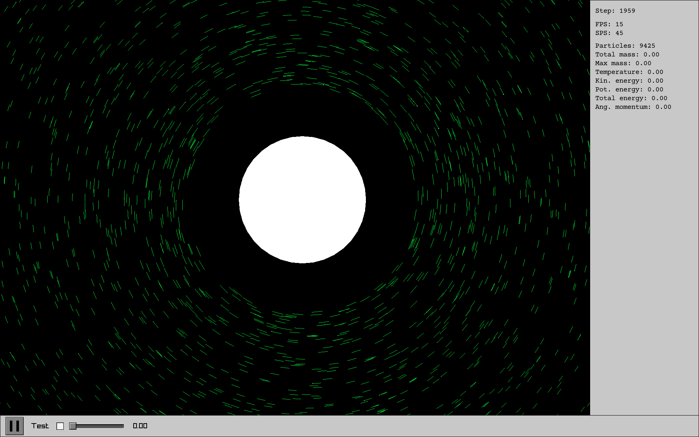

# Небосвод

"Небосвод" - астрофизическая симуляция частиц с гравитацией и аккрецией. 

Целью проекта было симулировать формирование планетарной системы из мелких частиц.

"Небосвод" написан на C и использует raylib для графики. Интерфейс реализован с помощью собственной библиотеки "Бетон" от RedCat17.

